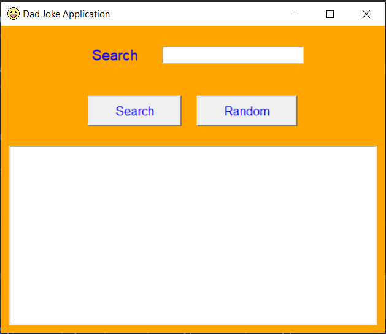
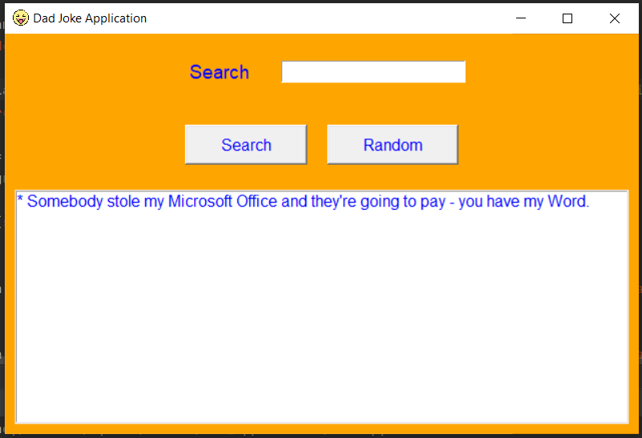
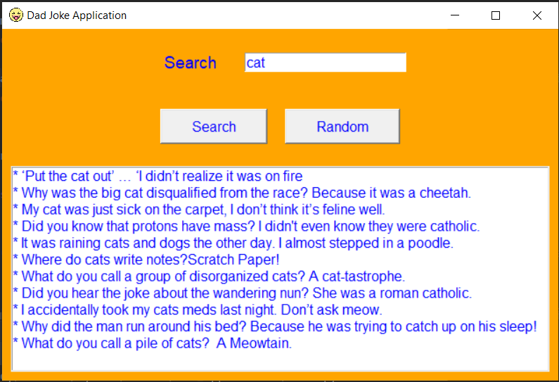

# Dad Jokes Application

## Project Overview
This is a simple GUI application that fetches random dad jokes or allows users to search for jokes. The application is built using Python and the tkinter library for the graphical user interface.

## Features
- Random Joke: Fetches and displays a random dad joke.
- Search Jokes: Allows users to search for jokes based on a specified term.

## Requirements
- Python 3.x
- tkinter library
- requests library

## Installation
1. Clone the repository:
    ```bash
    git clone https://github.com/reda-mohsen/Dad_Jokes_Application.git
    cd Dad_Jokes_Application
    ```

2. Install the required libraries:
    ```bash
    pip install -r requirements.txt
    ```

3. Run the application:
    ```bash
    python main.py
    ```

## Usage
1. Launch the application using the provided script.
2. Use the "Random" button to fetch and display a random dad joke.
3. Use the "Search" button to search for jokes based on a specified term.
4. The jokes are displayed in a listbox in the application window.

## Screenshots
 <br/>
 <br/>
 <br/>
